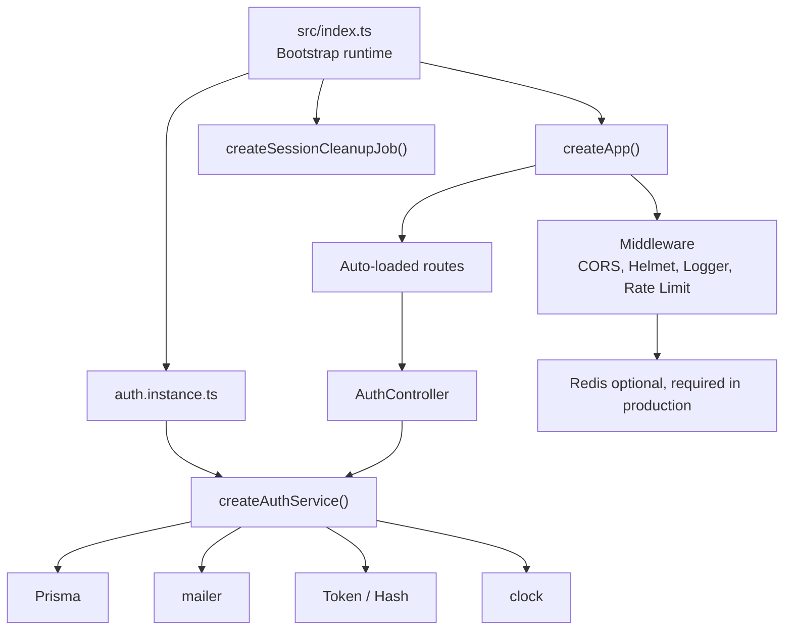
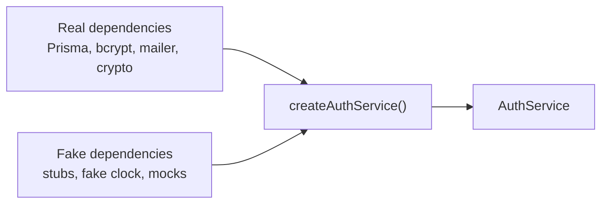
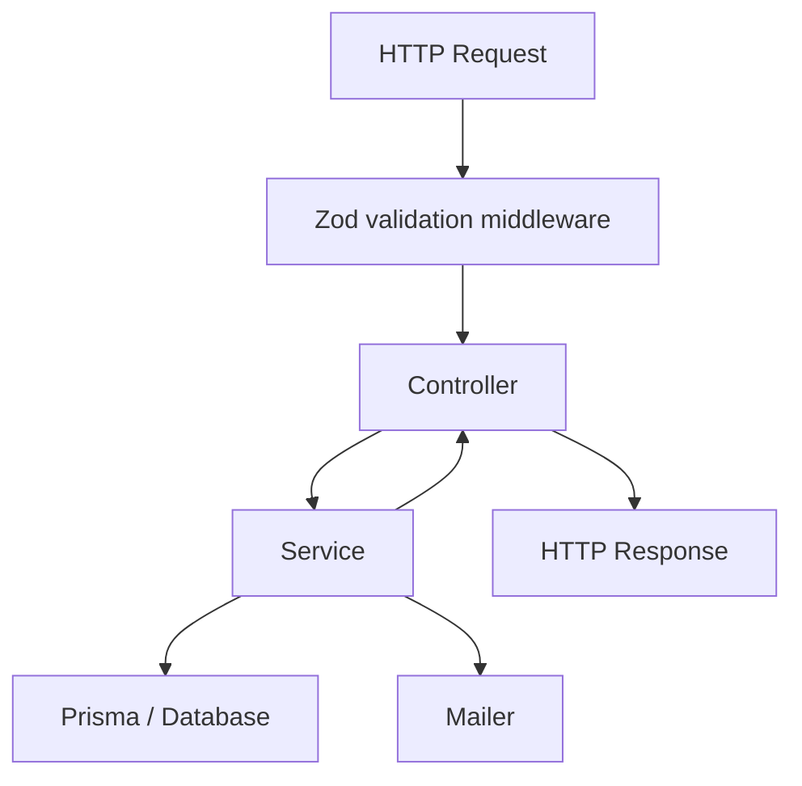
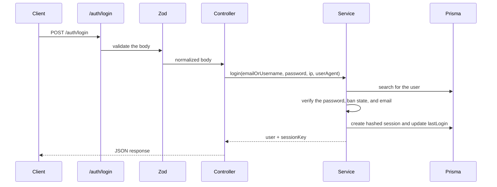

# Backend Architecture

> The following documention only covers the authentication flow part. It will be updated as development continues.

The backend is organized around small composable factories and dependencies are injected explicitly to improve testability.

## Overview



## App startup

The entry point is [`src/index.ts`](src/index.ts), it:

- reads the config
- creates external clients like Redis when configured
- prepares readiness checks
- assembles the Express app
- starts the server
- runs the periodic session cleanup
- and gracefully shuts down Prisma, Redis, and the HTTP server

## Factories

Example of a factory in this repository:

```ts
createAuthService({
  prisma,
  hasher,
  token,
  mailer,
  clock,
  config,
  logger,
});
```

The [createAuthService()](src/services/auth.service.ts) factory enables testing without a real database, SMTP server, or runtime dependencies.

## Dependency injection

The dependency injection is very light here.

We simply assemble objects by hand:



## Controllers and Services

How a standard HTTP request is processed:



### Controller

The controller handles the following tasks:

- Read `req.body`, `req.params`, `req.ip`
- call the service
- transform dates into ISO strings
- choose the HTTP status
- send errors to the global middleware

It shouldn't contain the business logic.

### Service

The service contains the business rules:

- create a user
- verify a password
- create a session
- refuse a banned user
- delete expired sessions
- send a verification email

It does not depend on Express.

## Simplified auth flow



## Simple rule about architecture if you want to contribute

When we add a new feature:

- validation goes into Zod schemas
- HTTP goes into the controller
- the business into the service
- external dependencies are injected
